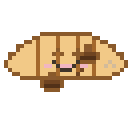

# 🍯 Honey & Bagel — an 8-bit macOS desk companion

**Honey** the cream heart and **Bagel** the golden croissant are two pixel-art
plush friends that live on your Mac. They **animate live in your menu bar** while
you work, and a larger version sits **on your desktop** for when you tidy your
windows away. They appear solo or together, quietly getting on with little tasks
— sipping coffee, watering plants, reading, dozing off — and the cast rotates
every few minutes with a quick *"someone's visiting!"* hello.

It's a lightweight menu-bar app (no Dock icon), built in Swift with SwiftUI + AppKit.

> **Heads up:** the app is distributed **unsigned** (ad-hoc signed, not notarized by
> Apple). It's safe, but macOS will warn you the first time you open it — see
> [First launch](#first-launch-important) below for the one-time step.

---

## Meet the cast

<p align="center">
  
  &nbsp;&nbsp;&nbsp;
  
</p>
<p align="center"><strong>Honey</strong> &nbsp;·&nbsp; <strong>Bagel</strong> — and when they hang out together:</p>
<p align="center">
  
</p>

<sub>Actual sprites rendered from <code>honey-and-bagel.json</code>, scaled ×8.</sub>

---

## Features

- 🧑‍🤝‍🧑 **Two characters** — Honey and Bagel, each with 12 solo scenes, plus 7
  "together" scenes (coffee for two, dance party, movie night, picnic, high-five,
  nap, duet).
- 🔁 **Cast rotation** — auto-cycles Honey → both → Bagel → both, with a brief
  greeting when the cast changes.
- 🎛️ **Choose who shows up** — toggle Honey, Bagel, and Together in/out of the
  rotation, or pin the app to one cast.
- 🧠 **Time-aware** — leans toward sleeping/napping at night and coffee in the morning.
- 🪟 **Two places at once** — animated in the menu bar *and* on the desktop;
  the window resizes itself (square solo, wider when both are present).
- 📏 **Resizable** — Small / Medium / Large, crisp integer scaling.
- 📌 **Pin to any corner**, or drag it anywhere.
- 🗂️ **Layering** — sit *behind* your windows (a calm background companion) or
  stay *always on top*.
- 💾 **Remembers your settings** across restarts.

---

## Requirements

- macOS **13 (Ventura)** or later
- Apple Silicon **or** Intel (the release is a universal binary)

---

## Install

1. Download **`Honey-macOS.zip`** from the [Releases](../../releases) page.
2. Unzip it and drag **`Honey.app`** into your **Applications** folder.

### First launch (important)

Because the app isn't notarized by Apple, Gatekeeper blocks it on the first run.
Pick **one** of these:

**Option A — Right-click to open**
1. In Applications, **right-click** (or Control-click) `Honey.app` → **Open**.
2. In the dialog, click **Open** again.

   *(You only need to do this once. On macOS 15+ you may instead get a prompt in
   **System Settings → Privacy & Security** with an "Open Anyway" button.)*

**Option B — Terminal (one command)**
```bash
xattr -dr com.apple.quarantine /Applications/Honey.app
```
Then double-click as normal.

Honey has **no Dock icon** — look for the animated sprite in your **menu bar**
(top-right). Click it for the menu.

---

## Using Honey

Click the menu-bar sprite:

| Menu item | What it does |
|-----------|--------------|
| **Cast** | **Auto (rotate)**, or pin to just **Honey**, **Bagel**, or **Honey & Bagel** (together). |
| **In the rotation** | Toggle which casts the Auto loop may visit — Honey, Bagel, Together. (At least one stays on.) |
| **Scene** | Jump to a specific scene in the current cast. It keeps auto-rotating afterward. |
| **Show on Desktop** | Toggle the larger desktop companion on/off. |
| **Size** | Small / Medium / Large. |
| **Pin to Corner** | Bottom Right / Bottom Left / Top Right / Top Left. (You can also just drag it.) |
| **Layer** | **Behind Everything** (covered by your windows, visible on the desktop) or **Always on Top**. |
| **Quit** | Quit. |

All choices are saved and restored next time you launch.

---

## Build from source

You'll need Apple's **Command Line Tools** (`xcode-select --install`) — full Xcode
is not required.

```bash
# Quick local build + run (native architecture)
./build.sh
open Honey.app

# Release build: universal (arm64 + x86_64), signed, zipped to dist/
./package.sh
```

Project layout:

```
Sources/Honey/
  main.swift         # NSApplication bootstrap (.accessory = no Dock icon)
  AppDelegate.swift  # menu-bar item, animated icon, window, menu, settings
  Honey.swift        # animation + cast/scene-rotation engine
  ContentView.swift  # SwiftUI Canvas that draws the pixels
  SpriteData.swift   # decodes the casts, scenes + palette
  Resources/
    honey-and-bagel.json  # source of truth: palette + casts (honey/bagel/both) × scenes × frames
Info.plist           # bundle metadata (LSUIElement, min OS, etc.)
build.sh             # dev build
package.sh           # release build → dist/Honey-macOS.zip
```

### Troubleshooting

- **`error: redefinition of module 'SwiftBridging'`** when building — your Command
  Line Tools have a stale modulemap. Fix:
  ```bash
  sudo mv /Library/Developer/CommandLineTools/usr/include/swift/module.modulemap{,.bak}
  ```

---

## Uninstall

1. Quit Honey (menu → **Quit Honey**).
2. Delete `/Applications/Honey.app`.
3. (Optional) remove saved settings:
   ```bash
   defaults delete com.honey.desk-companion
   ```

---

## Notes & limitations

- **Unsigned / not notarized.** This is a hobby build; the [first-launch step](#first-launch-important)
  is required. For warning-free distribution you'd need an Apple Developer ID +
  notarization.
- The "menu bar while working, desktop when idle" effect is achieved *passively*
  via the **Behind Everything** layer — Honey doesn't actively detect whether the
  desktop is showing.
- The on-screen label uses **Menlo** (always installed). Drop in a pixel font like
  *Press Start 2P* and tweak `ContentView.swift` if you want the full retro look.
